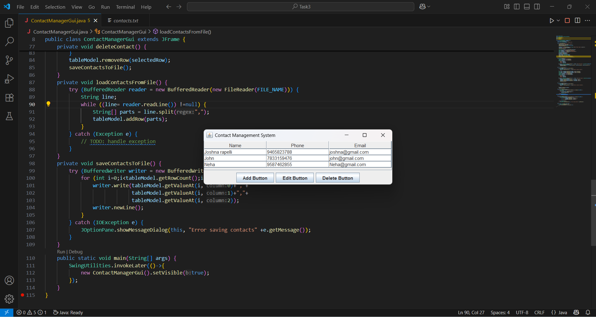

# PRODIGY_SD_03
Simple Contact Management 
The Contact Management System is a Java-based desktop application designed to store and manage personal contact information. It is developed using Java Swing for the graphical user interface and file handling for persistent storage. The system provides essential features such as adding new contacts, viewing the contact list, editing existing entries, and deleting contacts when required. Each contact record consists of a name, phone number, and email address, which are displayed in a table (JTable) for easy viewing. User input is collected through dialog boxes (JOptionPane), and changes are automatically saved into a text file (contacts.txt), ensuring that the data remains available even after the program is closed. The application employs event-driven programming through ActionListener and lambda expressions, which makes the interface interactive and responsive. This project demonstrates the integration of GUI programming, file I/O operations, and event handling in Java, and it serves as a practical example of how small-scale applications can be developed to manage information efficiently.

